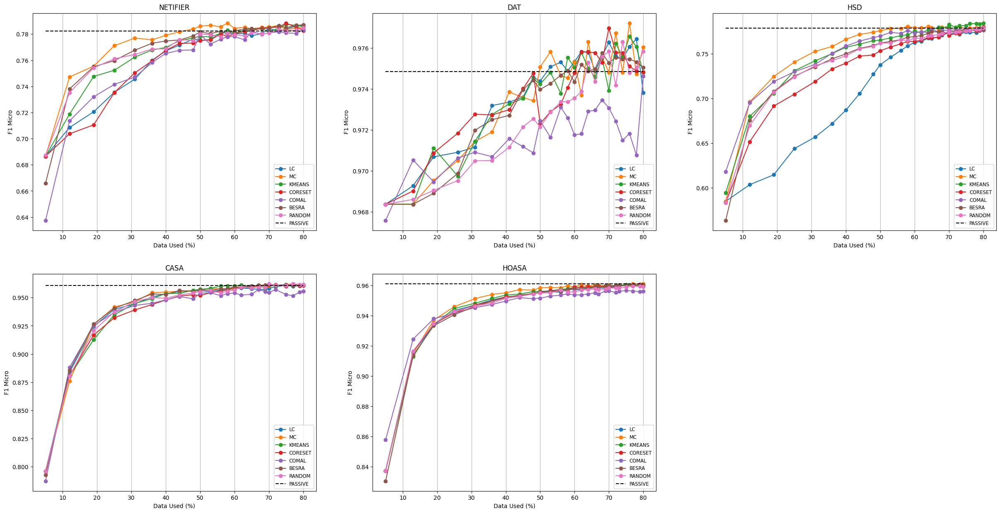
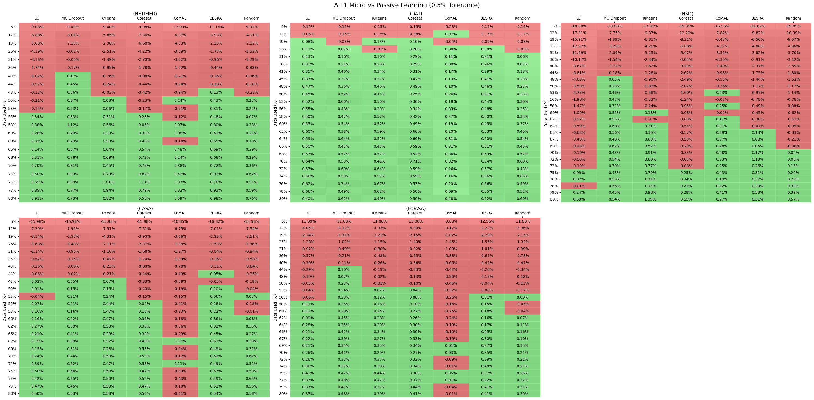
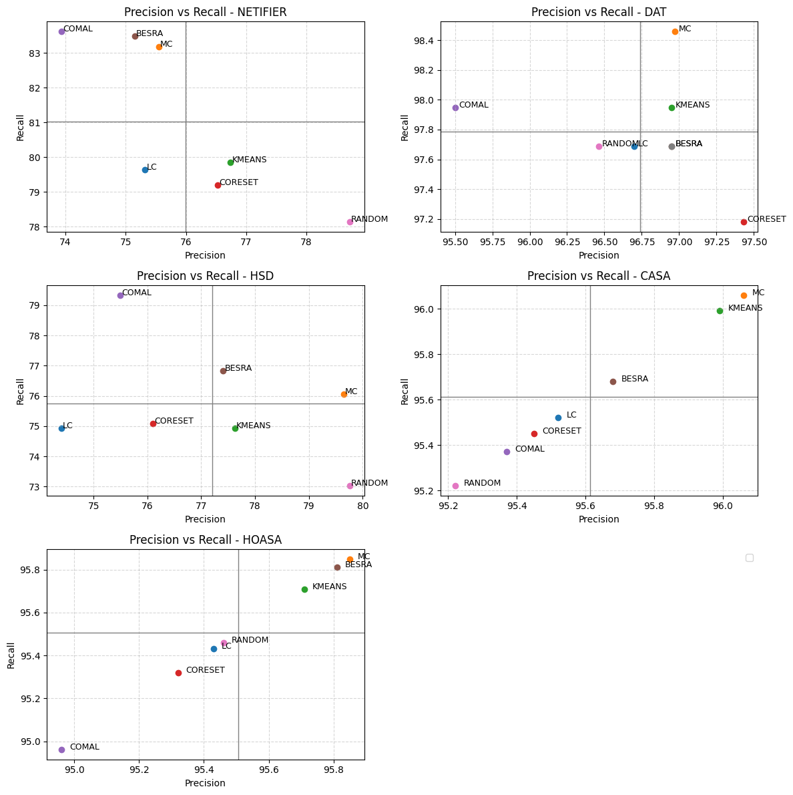
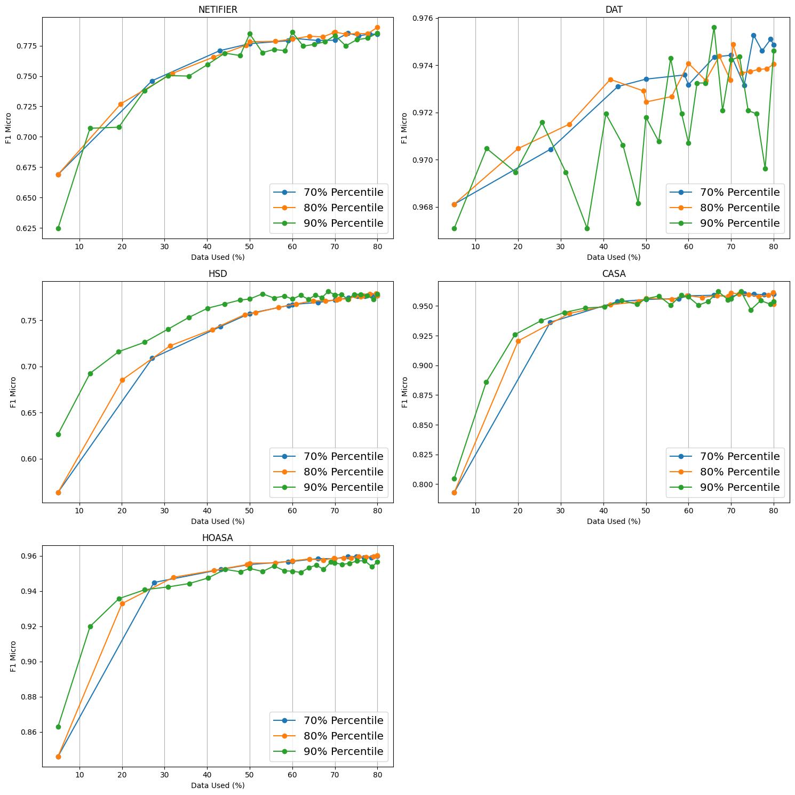
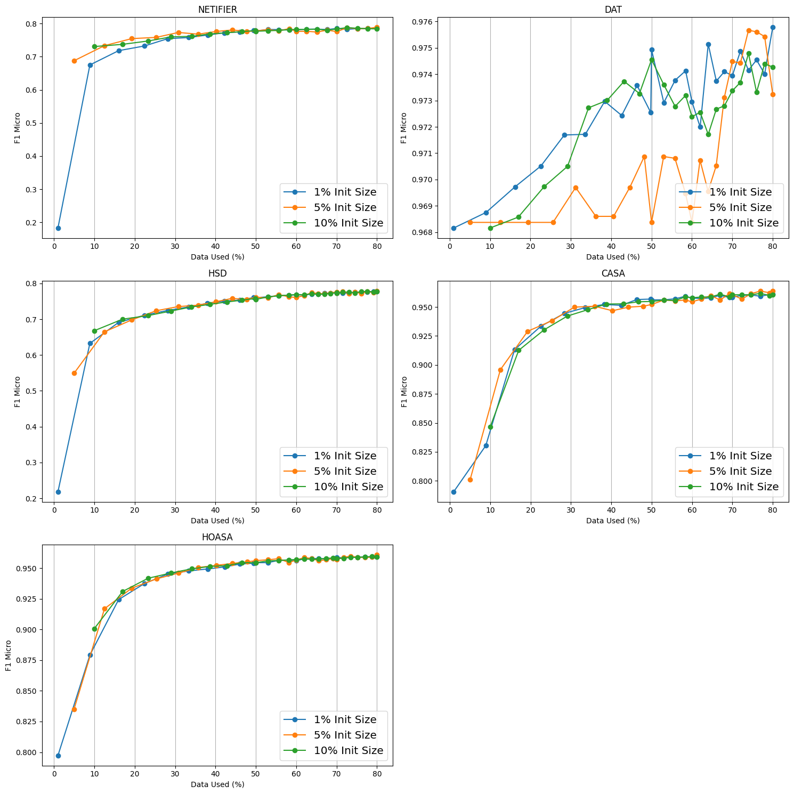

# Abstract
The manual data labeling process requires significant costs and time, especially for Indonesian texts which have complex morphology and limited multi-label datasets. This challenge is amplified by inherent issues in multi-label classification such as imbalanced label distribution and inter-label correlations that need to be addressed. This study employs an active learning method to reduce the amount of data that needs to be labeled. Various query strategies are utilized, including Least Confidence, Monte Carlo Dropout, K-Means, Coreset, BESRA, CoMAL, and Random Sampling as a baseline. The IndoBERT model was applied to five Indonesian multi-label text datasets: CASA, HOASA, Netifier, Multi-label Hate Speech and Abusive Language Detection, and Doctor's Answer Text. Efficiency and performance were evaluated using the F1-micro metric, comparing the results of active learning and passive learning. The results indicate that active learning can achieve performance comparable to passive learning (with a 0.5% tolerance) by using 40-48% of the data, demonstrating an efficiency of 32-40%. Monte Carlo Dropout consistently emerged as the best query strategy, outperforming random sampling across all datasets and being the fastest to achieve performance equivalent to passive learning on 3 out of the 5 datasets.

# Result
1. Active Learning Strategies Performance

2. Performance vs Passive Learning

3. Precision-Recall Plot

4. Dynamic Threshold Impact on Performance

5. Initial Data Size Impact on Performance

